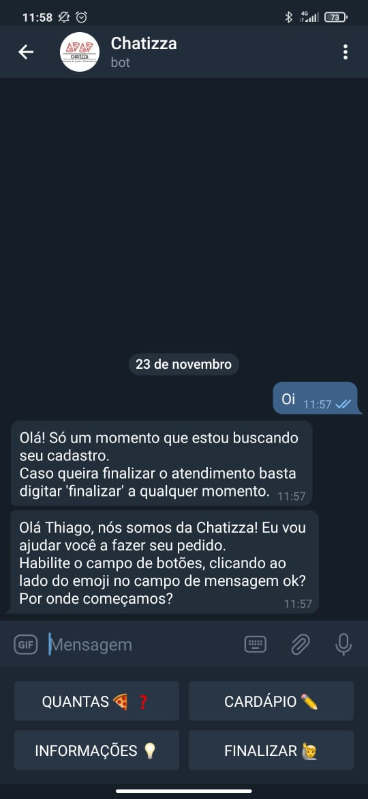
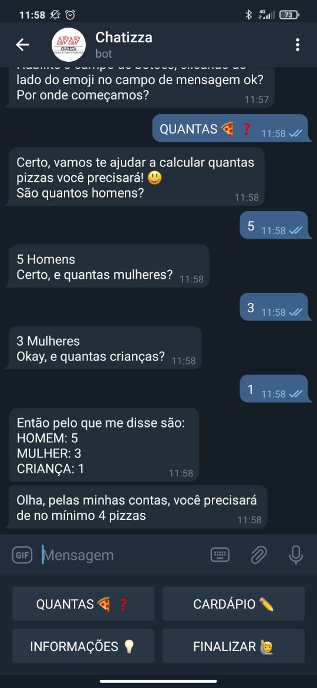
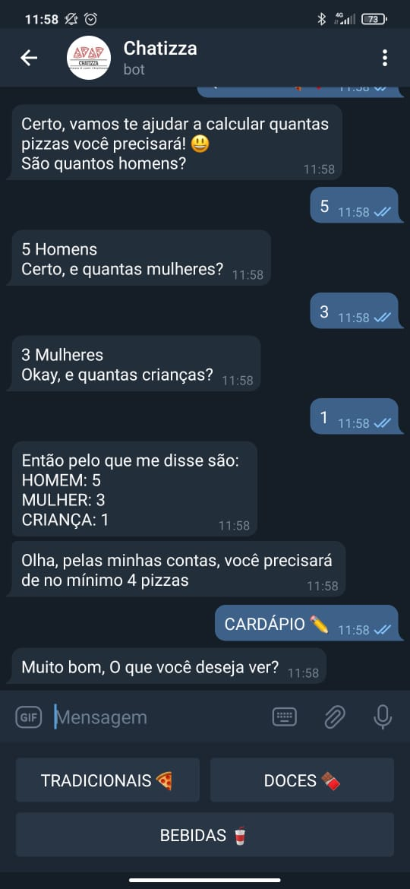
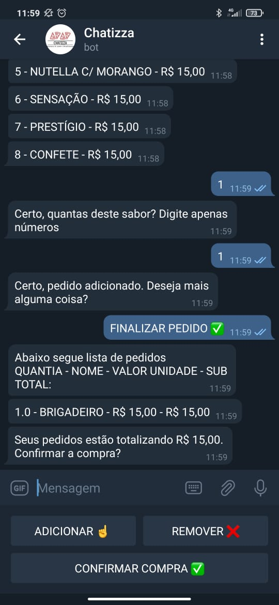
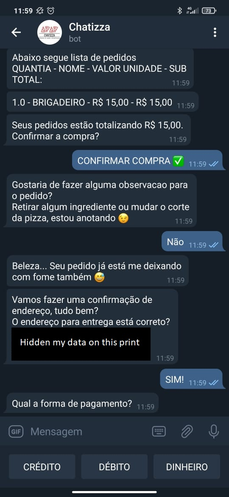
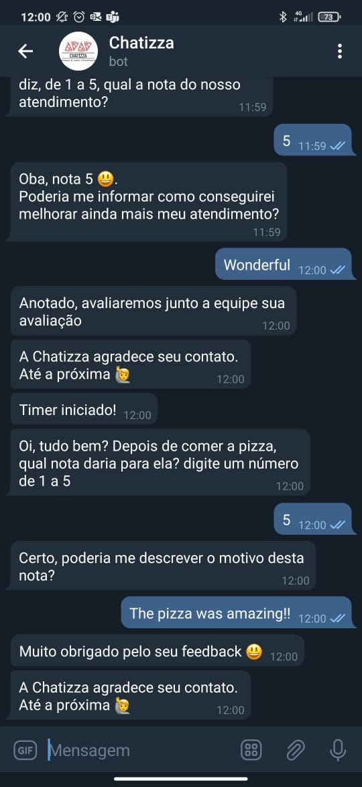

**Hello!**

Implementation of a Chatbot to work with Pizza orders. Built with Telegram API, Python and SQL. Using 2 approches with Machine Learning models:

* To predict and suggest pizza toppings to clients;
* To analyze post-sale feedback and comments.

Models implemented:

* Random Forest;
* Logistic regression;
* Naive Bayes;
* KNN;
* Term Frequency-Inverse Document Frequency (TF-IDF);
* Bag of words (BOW).

The BOW and TF-IDF was made with a tweet file.

In the "Jupyter" file you will find the construction of the models.

**Important:** 
* The ".py" file with the bot's implementation and use of the models built in jupyter is not available here, since it was made for a client. If you want to see it in action, you can see some screenshots at the end of this MD. Also, you can send me a message so I start it for you.
* This project was built for a Brazilian client, so the features, objects, and models have their names in Portuguese.

**Conclusions**

* Telegram API gives you a high-quality solution to improve your time of response to your clients;
* The NLP was built in Portuguese, so there is not as much data available as I wanted relating to the target fo the project;
* The database was not archived before this project and the owner did not have too much information to make better decisions;
* Now all the information available helps him in his executive decisions.

Here you can see some prints as an example of the solution. As I mentioned before, the solution is in Portuguese since the client is from Brazil:

 | 

 | 

 | 
